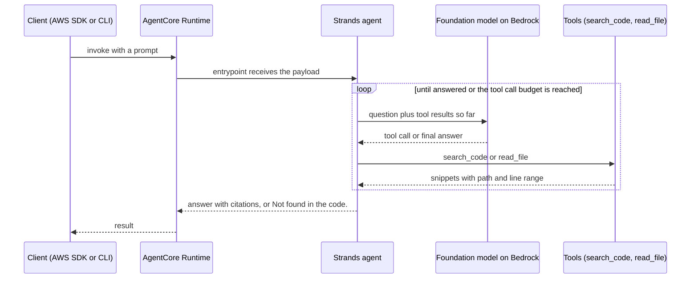
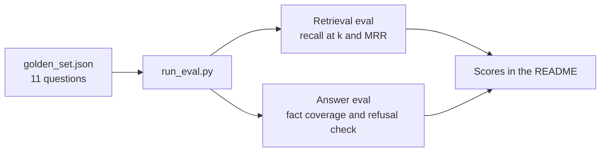

# Codebase Q&A Agent on Amazon Bedrock AgentCore

A proof of concept agent that answers questions about a Java Spring Boot codebase, cites file and line references, and refuses to guess. It is hosted on **Amazon Bedrock AgentCore Runtime** and built with the **Strands Agents SDK**. The point of the project is the accuracy measurement around it, not just the agent.

## Use case

Engineers modernizing or migrating a legacy Java service spend hours finding where behavior lives (retries, idempotency, event publishing). This agent retrieves the relevant code, answers from it, and cites `path:start-end` for every claim so a reviewer can verify in seconds.

## Architecture

```
Client (AWS SDK / CLI)  ->  AgentCore Runtime  ->  Strands agent  ->  Foundation model on Amazon Bedrock
                                                        |
                                            tools: search_code, read_file
                                                        |
                                     retriever.py (method aware chunks + BM25)
                                                        |
                                                  sample_repo/
```

### Request flow



### Evaluation flow



| Piece | What it does |
|---|---|
| `agent.py` | Strands agent wrapped with `BedrockAgentCoreApp`; `@app.entrypoint` accepts `{"prompt": "..."}` |
| `retriever.py` | Chunks code at method boundaries, ranks with BM25 (no external dependencies) |
| Tool call budget | Caps tool calls per question (default 8) so the agent cannot loop or run up cost |
| Path guard | `read_file` refuses any path outside the repo root |
| System prompt | Answer only from retrieved code, cite every claim, say "Not found in the code." otherwise |
| `eval/` | Golden set of 11 questions plus a harness that scores retrieval and answers |

## Measuring accuracy

The golden set has 10 answerable questions with expected source files and expected facts, plus 1 deliberately unanswerable question to test that the agent refuses instead of hallucinating.

| Layer | Metric | How |
|---|---|---|
| Retrieval | recall@k, MRR | Did the right file appear in the top k results? |
| Answer | fact coverage | Does the answer contain the expected facts? |
| Safety | refusal rate | Does it say the code lacks the answer for the unanswerable question? |

### Results: retrieval baseline (BM25)

Run locally on the sample repo, no AWS needed. The output was identical on Linux and on Windows 11 (PowerShell, Python venv).

```
python eval\run_eval.py --k 3
Retrieval: recall@3 = 100%, MRR = 0.88 over 10 questions
  PASS  q1  rank=1  How are retries configured for the payment service?
  PASS  q2  rank=1  What happens when the payment circuit breaker opens?
  PASS  q3  rank=1  How does the system prevent duplicate orders when a client retries a create request?
  PASS  q4  rank=1  How long are idempotency keys kept?
  PASS  q5  rank=1  Which Kafka topic are order events published to, and what is the message key?
  PASS  q6  rank=1  What happens to order events that fail to publish?
  PASS  q7  rank=1  Can a shipped order be cancelled?
  PASS  q8  rank=3  What are the connect and read timeouts for the payments HTTP client?
  PASS  q9  rank=1  What validation is applied when an order is created?
  PASS  q10  rank=2  Which Kafka producer settings protect against message loss or duplication?
```

| Metric | Result |
|---|---|
| recall@3 | 100% (10 of 10) |
| MRR | 0.88 |
| Right file ranked first | 8 of 10 |

The MRR below 1.0 shows where ranking is imperfect: the timeout question (q8) ranks the right file 3rd and the Kafka producer settings question (q10) ranks it 2nd. The unanswerable question (q11) is excluded from retrieval scoring and is only used in the answer evaluation.

### Improvement: chunk YAML by top level section

**Diagnosis:** `application.yml` was indexed as a single 38 line chunk, so all of its terms were diluted, and a Java chunk that mentioned the same words outranked it.

**Change:** split YAML files into one chunk per top level section (`spring`, `payments`, `resilience4j`), so each config block is scored on its own terms.

| Metric | Before | After |
|---|---|---|
| recall@3 | 100% | 100% |
| MRR | 0.88 | 0.95 |
| q10 (Kafka producer settings) | rank 2 | rank 1 |
| q8 (payments timeouts) | rank 3 | rank 2 |

q8 still ranks 2nd because the top hit, `PaymentClient.java`, has a comment that also mentions those timeouts. I did not tune further, since that would fit the eval set instead of improving retrieval. Semantic retrieval (below) is the next test.

Answer accuracy requires Bedrock access and has not been run yet: `python eval/run_eval.py --answers`. Add the results here once it has.

## Run it

Prerequisites: Python 3.10+, AWS credentials, and access to a foundation model enabled in Amazon Bedrock in your region.

```bash
python -m venv .venv && source .venv/bin/activate
pip install -r requirements.txt bedrock-agentcore-starter-toolkit

export MODEL_ID=<a Bedrock model ID enabled in your account>

# Local
python agent.py
curl -X POST http://localhost:8080/invocations \
  -H "Content-Type: application/json" \
  -d '{"prompt": "How are retries configured for the payment service?"}'

# Deploy to AgentCore Runtime
agentcore configure --entrypoint agent.py
agentcore launch
agentcore invoke '{"prompt": "What happens when the payment circuit breaker opens?"}'
```

Point it at your own repo with `REPO_ROOT=/path/to/repo`.

## Next steps

1. **Semantic retrieval:** add Amazon Titan embeddings and a vector store, then compare recall@k and MRR against the BM25 baseline using the same golden set.
2. **AgentCore Gateway:** expose repo search as a tool through Gateway so other agents can reuse it.
3. **AgentCore Memory:** keep conversation context across a code review session.
4. **AgentCore Observability:** trace every tool call and track latency and cost per question.
5. **LLM as judge:** add a rubric based judge for answers where keyword matching is too strict, and calibrate it against human review.
6. **Change proposals:** generate refactors as pull requests, gated by compile, tests, and human review.
